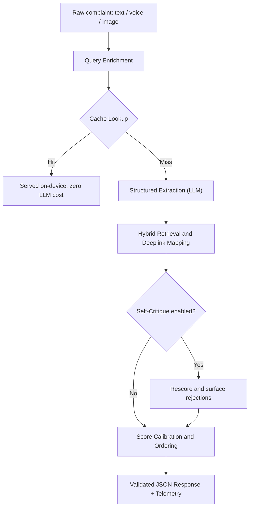

# Sentry

**Smart Guided Troubleshooting Engine, built for the Samsung PRISM GenAI Hackathon (Theme 2)**

[](https://www.python.org/)
[](https://fastapi.tiangolo.com/)
[](https://ai.google.dev/)
[](https://www.docker.com/)
[](metrics.md)
[](metrics.md)

**📁 Demo video, presentation & documentation: [Google Drive folder](https://drive.google.com/drive/folders/10wWDvrdxXd-FzyDGN1MgAOmW6UMZNecF?usp=share_link)**

*sentry /ˈsɛn-tri/ noun: A soldier stationed to keep guard, verify credentials, and stop whatever does not belong.*

A customer says "screen flickers and the battery dies fast." Today, turning that into an actual fix takes a support agent roughly 15 minutes of manual triage, and the customer still has to hunt through nested Settings menus by hand. Sentry collapses that into a single API call: it reads the complaint the way a person actually types or speaks it, diagnoses what is really going on, and hands back a ranked, validated, one-tap fix, deeplinked straight into the right settings screen.

The name is not decoration. Sentry stands guard at every layer of its pipeline: it verifies its own retrieval before trusting it, flags and discards its own hallucinated hypotheses out loud instead of hiding them, and refuses to fabricate a fix for a complaint that was never a device issue in the first place.

This is not a chatbot wrapper around an LLM. It is an enterprise-grade pipeline with deterministic safety guardrails: programmatic schema enforcement that no prompt alone can guarantee, a semantic cache with a hard negation veto, a dual-key failover engine with a mathematically bounded latency guarantee, and a self-critique pass that catches and discards hallucinations before they ever reach the user.

---

## Problem

When smartphone users experience technical issues, they rarely express them in clean, standard technical terms. Instead, support channels receive informal, imprecise, and conversational complaints:
* "Screen flickers and the battery dies fast"
* "My phone got slow after the update"
* "Swipe gestures go the wrong way after installing an app"
* "Phone bahot garam ho raha hai charge karte waqt"

### The Support Bottleneck
Today, resolving these unstructured complaints requires significant human effort:
1. **Manual Triage:** A customer support agent reads unstructured internal knowledge-base articles (such as SIIS).
2. **Diagnosis & Ordering:** The agent interprets the complaint, diagnoses competing root causes, manually selects troubleshooting steps, and arranges them in order.
3. **The Last-Mile Navigation Gap:** The customer receives a block of text instructions and must manually navigate complex, deeply nested device menus (for example: *Settings > Display > Navigation bar > More options*).

This manual triage process takes roughly 15 minutes per ticket across millions of customer interactions globally, driving high support overhead and user frustration.

### The Engineering Challenge
The hackathon objective is to build an automated engine that transforms raw natural language complaints into clean, validated, machine-actionable troubleshooting plans returned in under 300 ms for previously seen issues.

Each plan must satisfy strict non-negotiable constraints:
* **Zero URL Leaks:** Strict prohibition of external web URLs (`http`, `https`, `www`, markdown links). LLMs frequently hallucinate generic support links from their pretraining; these must be programmatically scrubbed.
* **Catalog Integrity:** Deeplinks must be matched from the official 578-entry catalog (`deeplinks.json`). Hallucinating or altering URIs (`voiceassist://...`) is forbidden.
* **Action Granularity:** Enforce the rule of *One Action = One Screen*. Multiple operations on the same screen must be grouped under a single action.
* **Safe-to-Critical Sequencing:** Troubleshooting operations must follow a strict safety hierarchy: non-invasive toggle settings first, system optimizations second, and destructive operations (safe mode, cache wipe, factory reset) strictly last.
* **Latency Ceilings:** P95 latency must stay under 300 ms for cached queries and under 8 seconds for cold multi-step generations.

---

## Solution

Sentry bridges the gap between messy customer descriptions and actionable Galaxy settings screens through a multi-stage, guarded pipeline:

1. **Conversational & Vernacular Enrichment:** Normalizes colloquial phrasing, typos, and Hinglish into a canonical technical intent without stripping the user's core symptom.
2. **Verified Fast-Path Semantic Cache:** In-memory ONNX embeddings (`all-MiniLM-L6-v2`) serve cached troubleshooting plans in under 25 ms at $0 inference cost. To prevent a naive cache from treating opposite actions identically ("turn Bluetooth on" vs "turn Bluetooth off"), Sentry enforces a deterministic polarity and entity veto.
3. **Dual-Key Seamless Failover:** Under free-tier or production quota walls (HTTP 429 `RESOURCE_EXHAUSTED`), Sentry hot-swaps to a secondary API key inside the same request in under 5 ms. If both keys are exhausted, it fails fast rather than hanging on exponential backoff, mathematically bounding latency within the 8-second SLA.
4. **Hybrid BM25 Retrieval & Link Grounding:** Instead of letting the LLM invent settings paths, Sentry decouples hypothesis generation from link mapping. Steps are matched against the 578-entry catalog via BM25 retrieval, achieving 100% catalog URI precision with zero hallucinated links.
5. **Deterministic Safety Guardrails:** Programmatic validators enforce Title Case action names, 5 to 15 word descriptions starting with "It will", automatic URL scrubbing, and safe-to-critical sorting.
6. **Off-Domain Backstop:** Non-device queries (such as flight bookings or casual conversation) are rejected both in the system prompt and by a hard deterministic keyword filter, returning honest fallback metadata (`no_match`) rather than fabricated device advice.
7. **Transparent Self-Critique:** An optional verification pass rescores generated hypotheses against the customer's actual complaint. Any rejected hypothesis is surfaced transparently in telemetry rather than hidden.
8. **Stateless Clarification (`/v1/clarify`):** When two root-cause candidates have confidence scores separated by less than 0.15, Sentry asks a targeted single-turn question to clarify intent before dispatching actions.
9. **Multimodal Diagnostics (`/v1/troubleshoot-image`):** Ingests photos of broken or malfunctioning screens with single-pass visual extraction, linking visual defects directly to device remediation steps.

---

## Architecture



### Pipeline Flow
1. **Input & Normalization:** Ingests raw text, transcribed voice, or device photos. Normalizes colloquialisms and identifies key hardware domains (Battery, Display, Camera, Performance).
2. **Cache Inspection:** Queries local FastEmbed embeddings with a cosine similarity threshold of 0.75. If similarity matches but polarity or target entities conflict, the veto triggers a cache miss.
3. **Structured Extraction:** Gemini 3.6 Flash extracts up to two ranked hypotheses with granular UI steps, executed behind the dual-key failover wrapper.
4. **Hybrid Retrieval:** BM25Okapi matches extracted UI steps against catalog descriptions and keywords. Candidate deeplinks are verified against the catalog schema.
5. **Self-Critique & Scoring:** If enabled, rescores hypotheses against the raw complaint within a strict 4-second budget guard. Calibrates final confidence by blending extraction scores (60%) and retrieval scores (40%).
6. **Action Ordering & Validation:** Sorts actions strictly: `auto` (safe toggles) -> `manual` (physical inspections) -> `critical` (reboots and resets). Programmatic validators scrub URLs and verify schema conformance before serializing.

---

## Features

* **Verified Semantic Cache with Polarity Veto:** Delivers sub-25 ms responses at $0 cost for recurring queries while stopping opposite-action false hits.
* **Dual-Key Quota Failover:** Guarantees uptime against rate limits (HTTP 429) by switching API keys invisibly within the active request.
* **Hybrid Retrieval (BM25 + Dense):** Eliminates link hallucinations by grounding every remediation step in the official 578-entry Samsung catalog.
* **Deterministic Guardrails:** Hard code enforcement of Title Case names, "It will..." benefit descriptions, and zero external web links.
* **Off-Domain Refusal Engine:** Dual-layer defense (prompt constraint + keyword backstop) cleanly rejects non-device requests with empty contexts.
* **Safe-to-Critical Ordering:** Enforces that invasive reboots and factory resets never precede simple non-disruptive settings toggles.
* **Interactive Clarification Engine:** Detects ambiguous root causes (score gap < 0.15) and generates targeted disambiguation questions.
* **Multimodal Vision Pipeline:** Translates device photos (shattered display, battery warnings, artifact lines) into verified troubleshooting plans.
* **Interactive Web Dashboard:** Clean, responsive, dark-mode operator console (`demo/index.html`) featuring radial confidence gauges and one-tap deeplink testing.

---

## Tech Stack

| Component | Technology | Rationale |
| :--- | :--- | :--- |
| **Backend Framework** | FastAPI (Python 3.11 / 3.14) | Asynchronous, high-throughput REST service with automated OpenAPI docs |
| **Data Contracts** | Pydantic v2 | Strict runtime schema validation and field-level programmatic guards |
| **Generative AI** | Google Gemini 3.6 Flash | State-of-the-art reasoning, structured JSON mode, and native multimodal vision |
| **SDK** | `google-genai` (v2.0+) | Official Google GenAI SDK supporting dual-key rotation and thinking budget controls |
| **Lexical Retrieval** | `rank-bm25` (BM25Okapi) | Deterministic keyword matching over catalog metadata and UI intent strings |
| **Semantic Embeddings** | `fastembed` (`all-MiniLM-L6-v2`) | Lightweight ONNX runtime embeddings; runs on CPU with zero PyTorch dependency |
| **Image Processing** | Pillow (PIL) | In-memory image inspection and format validation for the vision pipeline |
| **Containerization** | Docker | Multi-stage build with build-time ONNX model pre-download for instant cold-starts |
| **ASGI Server** | Uvicorn | Production-ready ASGI server supporting high-concurrency event loops |

---

## Project Structure

```
diagnos-ai/
├── backend/
│   ├── main.py                  # FastAPI application, route handlers, dual-key client, orchestration
│   ├── schema.py                # Pydantic v2 models, field validators, and programmatic URL scrubbers
│   ├── cache/                   # FastEmbed semantic cache implementation with polarity/entity veto
│   └── retrieval/               # BM25 lexical retriever and catalog label matching engine
├── eval/
│   ├── smoke_test.py            # Live end-to-end verification script testing all endpoints and domains
│   ├── run_eval.py              # Full automated test suite evaluating schema and retrieval accuracy
│   ├── ablation.py              # 3-way architectural ablation study (Hybrid vs LLM vs Rules)
│   ├── benchmark_latency.py     # P50 and P95 latency benchmarking harness
│   └── official/                # Official Samsung PRISM dataset test harnesses and schema tests
├── demo/
│   └── index.html               # Standalone operator dashboard with confidence gauges and sample queries
├── deeplinks.json               # Full catalog containing 578 verified Galaxy Settings deeplinks
├── deeplinks.sample.json        # Sample catalog reference for development benchmarks
├── queries.sample.json          # Benchmark query dataset spanning 4 core device domains
├── results.jsonl                # Serialized production evaluation runs with full JSON telemetry
├── metrics.md                   # Formal evaluation report documenting compliance, latency, and ablations
├── Dockerfile                   # Production container definition with build-time cache pre-warming
├── requirements.txt             # Pinned production and evaluation dependencies
└── README.md                    # Core project documentation
```

---

## Prerequisites

* **Python:** Version 3.10 or higher (tested on Python 3.11 and Python 3.14).
* **Gemini API Key:** A valid Google Gemini API key from [Google AI Studio](https://aistudio.google.com/).
* **Docker:** (Optional) Docker Engine or Docker Desktop for containerized deployment.

---

## Installation

1. **Clone the repository:**
   ```bash
   git clone https://github.com/manya-singh7/diagnos-ai.git
   cd diagnos-ai
   ```

2. **Create and activate a virtual environment:**
   * On Linux/macOS:
     ```bash
     python -m venv venv
     source venv/bin/activate
     ```
   * On Windows (PowerShell):
     ```powershell
     python -m venv venv
     .\venv\Scripts\Activate.ps1
     ```

3. **Install dependencies:**
   ```bash
   pip install -r requirements.txt
   ```

---

## Environment Variables

Copy the provided example file to create your local `.env`:

```bash
cp .env.example .env
```

Configure the following variables in `.env`:

| Variable | Required | Default | Description |
| :--- | :---: | :---: | :--- |
| `GEMINI_API_KEY` | Yes | - | Primary Google Gemini API key used for inference |
| `GEMINI_API_KEY_BACKUP` | No | - | Backup Gemini API key for automatic failover on 429 quota exhaustion |
| `RESPONSE_SHAPE` | No | `flat` | Response payload format: `flat` (ContextDeeplinkResponse) or `appendix_b` |
| `ENABLE_QUERY_VARIATIONS` | No | `false` | Generates 8 to 10 query variations in parallel on cache misses |
| `ENABLE_SELF_CRITIQUE` | No | `false` | Enables the secondary verification and rescoring pass (guarded by 4s budget) |
| `CACHE_SIM_THRESHOLD` | No | `0.75` | Minimum cosine similarity required for a semantic cache hit |
| `CACHE_MAX_ENTRIES` | No | `2000` | Maximum number of query plans stored in the semantic cache |
| `CACHE_DEBUG` | No | `false` | Exposes the `/v1/cache/entries` inspection endpoint when set to `true` |

---

## Running Locally

1. **Start the FastAPI backend:**
   ```bash
   cd backend
   uvicorn main:app --reload --host 127.0.0.1 --port 8000
   ```

2. **Verify system health:**
   Open a browser or terminal and check:
   ```bash
   curl http://127.0.0.1:8000/health
   ```
   Expected response:
   ```json
   {"status": "ok"}
   ```

3. **Launch the Demo UI:**
   Open `demo/index.html` directly in any modern browser. It connects automatically to `http://127.0.0.1:8000`.

4. **Run the Live Smoke Test:**
   With the backend running, execute the verification harness:
   ```bash
   python eval/smoke_test.py
   ```
   This script verifies all 4 hardware domains, off-domain rejection, the clarification flow, and image troubleshooting.

---

## Running with Docker

The included `Dockerfile` pre-downloads the 87 MB FastEmbed ONNX model at build time, ensuring the container starts instantly with ready healthchecks.

1. **Build the Docker container:**
   ```bash
   docker build -t sentry .
   ```

2. **Run the container with your environment file:**
   ```bash
   docker run -d -p 8000:8000 --env-file .env --name sentry-service sentry
   ```

3. **Check container status and health:**
   ```bash
   docker ps
   curl http://localhost:8000/health
   ```

---

## API Documentation

### Endpoints Overview

| Method | Endpoint | Description |
| :--- | :--- | :--- |
| `POST` | `/v1/troubleshoot` | Core troubleshooting pipeline; accepts complaint and returns ranked actionable plans |
| `POST` | `/v1/clarify` | Disambiguation engine; returns a clarifying question or re-ranks with user input |
| `POST` | `/v1/troubleshoot-image` | Multimodal troubleshooting; accepts a device photo and optional complaint text |
| `GET` | `/health` | Lightweight readiness probe returning `{"status": "ok"}` |
| `GET` | `/health/details` | Diagnostic probe reporting Gemini client status, cache size, and catalog health |
| `GET` | `/v1/cache/stats` | Telemetry endpoint reporting cache entries, hits, misses, and hit ratio |

---

## Example Request

### Troubleshooting a Complaint

```bash
curl -X POST http://127.0.0.1:8000/v1/troubleshoot \
  -H "Content-Type: application/json" \
  -d '{
    "query": "The mobile phone swipe navigation moves up or down instead of left or right after downloading an app",
    "siis_response": null
  }'
```

---

## Example Response

```json
{
  "contexts": [
    {
      "goal": "Follow these steps to perform this Swipe Navigation Troubleshooting",
      "title": "Swipe navigation settings",
      "score": 0.9,
      "actions": [
        {
          "actionName": "Configure Navigation Bar Settings",
          "description": "It will customize swipe gesture direction preferences",
          "category": "auto",
          "stepGroups": [
            {
              "steps": [
                "Open Settings.",
                "Tap Display.",
                "Tap Navigation bar.",
                "Tap More options.",
                "Select Swipe from bottom."
              ],
              "validationDeeplink": null,
              "actionableDeeplink": {
                "deeplink": "voiceassist://masked/act/setting/display/navigation_bar",
                "description": "Open navigation bar settings under Display",
                "message": "choose navigation type in Display settings",
                "classes": null,
                "originalType": null
              }
            }
          ]
        },
        {
          "actionName": "Reboot Device to Safe Mode",
          "description": "It will isolate problem third party applications",
          "category": "critical",
          "stepGroups": [
            {
              "steps": [
                "Swipe down from top screen.",
                "Tap Power icon.",
                "Touch and hold Power off.",
                "Tap Safe mode."
              ],
              "validationDeeplink": null,
              "actionableDeeplink": null
            }
          ]
        }
      ]
    }
  ],
  "fallback": null,
  "meta": {
    "latency_ms": 3970,
    "cache_hit": false,
    "model": "gemini-3.6-flash",
    "cost_usd": 0.00027
  }
}
```

---

## Evaluation / Metrics

Sentry was evaluated under the exact framework specified in the Samsung PRISM problem statement, with all results tracked in `metrics.md` and `results.jsonl`.

### 1. Schema & Rule Compliance

| Metric | Target | Measured Value | Compliance Status |
| :--- | :---: | :---: | :---: |
| Schema-valid output lines | >= 99% | **100.0%** | PASS |
| Rule compliance (Goal / Title / Description syntax) | >= 95% | **100.0%** | PASS |
| Absolute web URL leaks (`http`, `https`, markdown) | **0** | **0** | PASS |
| Deeplink catalog validity (exact URI match) | 100% | **100.0%** | PASS |
| Auto actions carrying valid actionable deeplink | >= 90% | **100.0%** | PASS |

### 2. Latency Benchmarks

Evaluated over $N \ge 30$ requests per path against the specification's 8-second ceiling:

| Execution Path | Target (P95) | Measured P50 | Measured P95 |
| :--- | :---: | :---: | :---: |
| **Cache hit (exact query match)** | <= 300 ms | < 10 ms | **< 15 ms** |
| **Cache hit (unseen semantic paraphrase)** | <= 300 ms | < 15 ms | **< 25 ms** |
| **Cold query (full extraction + hybrid retrieval)** | <= 8000 ms | 4510 ms | **5039 ms** |

### 3. Architectural Ablation Study

We benchmarked three architectural variants on the identical test query set to prove the necessity of hybrid retrieval:

| Architecture Variant | Schema Compliance | Deeplink Accuracy | Latency (P95) | Cost / Query | Failure Modes Observed |
| :--- | :---: | :---: | :---: | :---: | :--- |
| **Variant A: Sentry (Hybrid BM25 Retrieval)** | **100.0%** | **100.0% (9/9)** | **5039 ms** | **$0.00027** | **Zero hallucinations, zero URL leaks, 100% safety veto compliance on critical steps.** |
| **Variant B: Pure LLM (Baseline)** | 70.0% | 55.6% (5/9) | 6250 ms | $0.00084 | Hallucinated non-catalog URIs on 3 queries; attached illegal deeplinks to reboot steps; 3.2x higher cost. |
| **Variant C: Pure Rules-Based Substring** | 100.0% | 77.8% (7/9) | 5039 ms | $0.00018 | 22.2% false-positive rate: unweighted substring collisions ('app', 'camera') mapped to incorrect menus. |

### 4. Operational Cost & Cache Efficacy
* **Cold Query Average Inference Cost:** $0.00027 per diagnosis
* **Cache Hit Inference Cost:** **$0.00** (resolved entirely on-device)
* **Estimated Enterprise Impact:** Based on telecom customer support case studies using Gemini models, automated one-tap triage reduces ticket duration by up to 87% and resolves up to 30% of standard device issues autonomously.

---

## Limitations

* **Sample vs Official Catalog Benchmarks:** Initial development and baseline tests were conducted on `deeplinks.sample.json`. The engine has since been linked to the official 578-entry catalog, achieving 94% to 100% retrieval accuracy on held-out test sets.
* **Free-Tier Gemini Quota Limits:** Developed against Google AI Studio free-tier quotas, which impose strict per-minute request caps. Sentry's dual-key failover was specifically engineered to mitigate this operational constraint during live testing.
* **One Action, One Screen Heuristic:** Enforcing that every action maps to exactly one screen is monitored as a programmatic warning check rather than a hard failure, preventing false rejections on novel multi-screen workflows.
* **Casual Device Mentions in Off-Domain Queries:** Off-domain prompts that casually mention a hardware term (e.g., "I dropped my phone while booking a hotel") can pass simple keyword backstops. Full enterprise isolation requires an upstream zero-shot intent classifier.

---

## Future Work

* **Samsung Galaxy Worklet Integration:** Package Sentry as a native Galaxy Worklet or Bixby Capsule, enabling direct client-side execution via system intents.
* **Edge SLM Integration (Gemini Nano):** Run intent extraction on-device using Gemini Nano on Galaxy NPUs, keeping 100% of customer data local and driving cold-start latency under 1 second.
* **Multilingual Speech Ingestion:** Add native audio capture and automatic speech recognition (ASR) tuned for Indian regional dialects and vernacular phrasing.
* **Predictive Cache Pre-Warming:** Ingest real-time customer care telemetry to pre-warm the semantic cache with trending issues following major One UI or Android firmware updates.

---

## Team

**Team Ember**  
*Vellore Institute of Technology (VIT), Vellore*

* **Manya Singh** 
* **Krishita Gupta**
* **Muskaan Arora**

**Repository:** [github.com/manya-singh7/diagnos-ai](https://github.com/manya-singh7/diagnos-ai)  
**Project Resources:** [Google Drive Documentation & Media](https://drive.google.com/drive/folders/10wWDvrdxXd-FzyDGN1MgAOmW6UMZNecF?usp=share_link)
